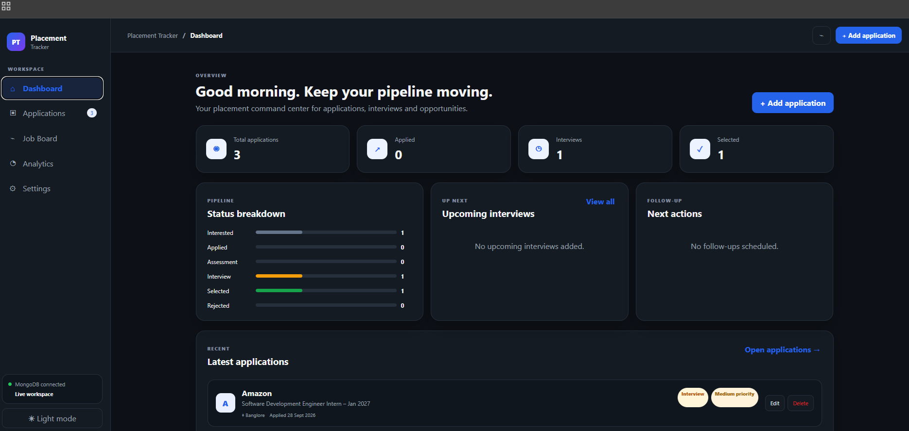
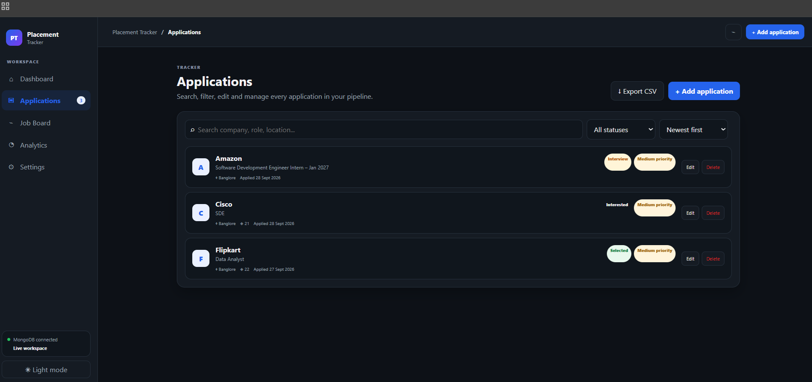
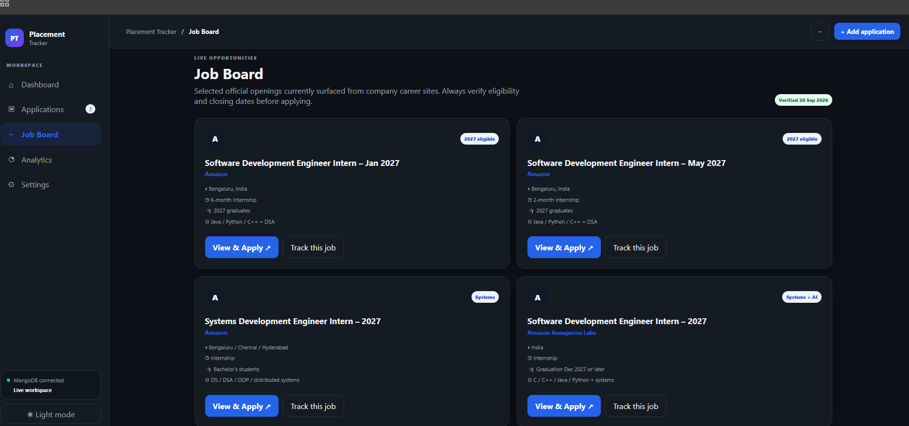
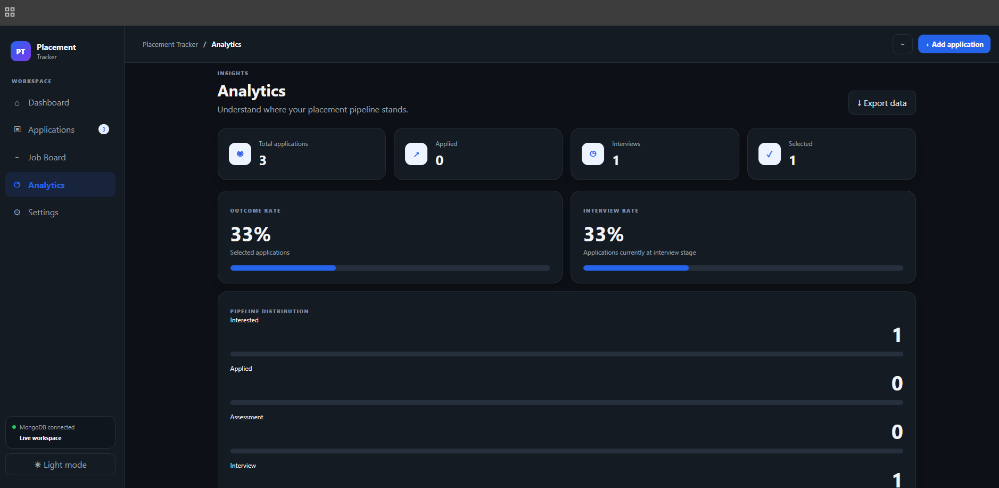
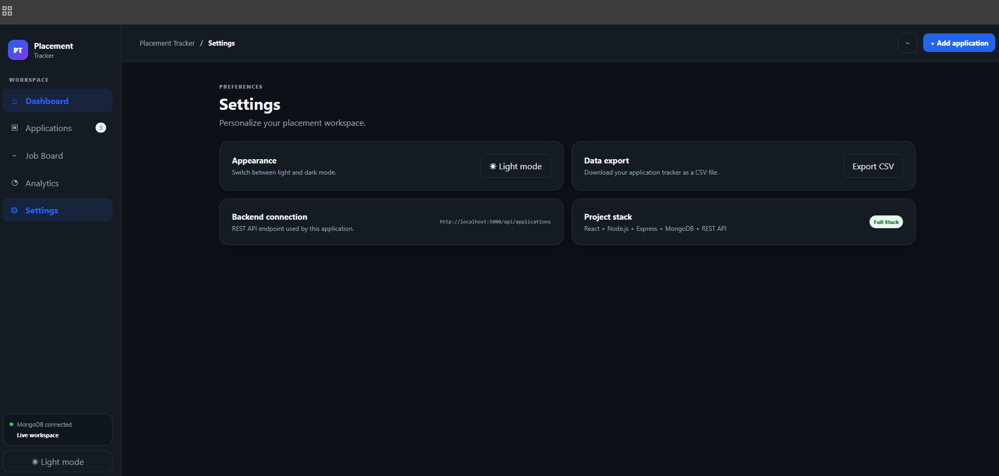

# 📌 Placement Tracker

> A full-stack web application to manage, track, and analyze job and placement applications from a single dashboard.

Placement Tracker is a portfolio-ready full-stack application built using **React, Node.js, Express.js, and MongoDB**. It helps students keep track of companies, job roles, application status, interviews, follow-ups, priorities, and job opportunities.

---

## 🚀 Live Project

🔗 **GitHub Repository:**  
https://github.com/Nitesh0Dev/placement-tracker

> The application currently runs locally using React, Express.js, and MongoDB.

---

## ✨ Features

### 📊 Dashboard
- Total applications
- Applications by status
- Upcoming interviews
- Follow-up reminders
- Recent applications
- Quick overview of placement progress

### 📝 Application Management
- Add new job applications
- Edit existing applications
- Delete applications
- View complete application details
- Track:
  - Company
  - Job role
  - Package
  - Location
  - Application date
  - Interview date
  - Follow-up date
  - Status
  - Priority
  - Application source
  - Job URL
  - Notes

### 🔎 Search & Filtering
- Search by company, role, or location
- Filter applications by status
- Sort applications
- Quickly find specific opportunities

### 📈 Analytics
- Application status distribution
- Placement pipeline overview
- Progress statistics
- Visual representation of application activity

### 💼 Job Board
- Curated job opportunities
- Official company application links
- Job details
- "Track this Job" functionality
- Automatically pre-fill application details before applying

### 🌓 User Experience
- Responsive design
- Light mode
- Dark mode
- Mobile-friendly navigation
- Persistent theme preference

### 📤 Data Export
- Export application data as CSV
- Useful for maintaining personal placement records

---

# 🛠️ Tech Stack

| Layer | Technology |
|---|---|
| Frontend | React.js, Vite, CSS |
| Backend | Node.js, Express.js |
| Database | MongoDB |
| ODM | Mongoose |
| API | REST API |
| Version Control | Git & GitHub |
| Development | VS Code |
| API Testing | Thunder Client |

---

# 🏗️ Architecture

```text
                  ┌─────────────────────┐
                  │      React UI       │
                  │     Frontend        │
                  └──────────┬──────────┘
                             │
                             │ REST API
                             ▼
                  ┌─────────────────────┐
                  │   Express.js API    │
                  │      Backend        │
                  └──────────┬──────────┘
                             │
                             │ Mongoose
                             ▼
                  ┌─────────────────────┐
                  │      MongoDB        │
                  │  placement_tracker  │
                  └─────────────────────┘

                  ```


# 📸 Screenshots

## 📊 Dashboard

The dashboard provides a quick overview of applications, interviews, follow-ups, and recent placement activity.



---

## 📝 Applications

Manage job applications with search, filtering, sorting, status tracking, priorities, and application details.



---

## 💼 Job Board

Browse selected job opportunities and track interesting positions directly from the application.



---

## 📈 Analytics

Visualize application progress and understand the overall placement pipeline.



---

## ⚙️ Settings

Customize the application experience, including theme preferences and other settings.

